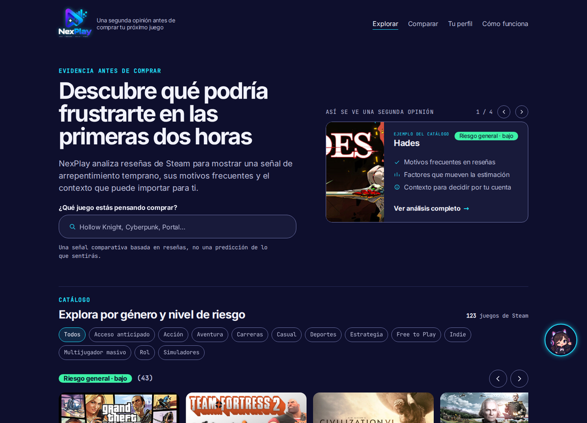

# NexPlay

**Una segunda opinión antes de comprar tu próximo juego.** Explorás el catálogo, ves
qué banda de riesgo tiene cada título y por qué (motivos reales de reseñas de Steam,
no una nota genérica), y decidís con eso encima.



## Qué es

Estima el riesgo de **arrepentimiento temprano** al comprar un videojuego, antes de la
compra. `Y = 1` si `playtime_at_review < 120` minutos (ventana de reembolso de Steam) y
`voted_up == 0`. Es una señal proxy: Steam no observa arrepentimiento real.

Proyecto del Módulo V del Diplomado en Ciencia de Datos, FES Acatlán (UNAM). Contexto
completo (datos, validación, qué no hacer) en [CLAUDE.md](CLAUDE.md).

Narrativa completa (Problema → Datos → EDA → Calidad de datos → Ingeniería de variables →
Modelo → Experimento de privacidad → Conclusiones) en `notebook/nexplay.ipynb`, ejecutable de
punta a punta en un Colab limpio:

[](https://colab.research.google.com/github/fernandoaxelramirezgomez-coder/nexplay/blob/master/notebook/nexplay.ipynb)

Esta guía es la otra mitad: **cómo dejar el proyecto completo (API + modelo + UI)
funcionando en una máquina limpia**, no solo el notebook.

## Puesta en marcha, de cero

Requisitos: Python 3.10+ y `git`. No hace falta cuenta ni credenciales de Steam ni de
GitHub — todo lo que se descarga es público.

```bash
git clone https://github.com/fernandoaxelramirezgomez-coder/nexplay.git
cd nexplay

python -m venv .venv
source .venv/bin/activate          # Windows: .venv\Scripts\activate

pip install -r requirements.txt -r requirements-modelo.txt

python herramientas/preparar_entorno.py
```

`herramientas/preparar_entorno.py` hace, en orden:

1. Verifica que las dependencias estén instaladas.
2. Descarga el asset del [release `data-v2`](https://github.com/fernandoaxelramirezgomez-coder/nexplay/releases/tag/data-v2)
   (el catálogo que sirve la API) y el del [release `data-v1`](https://github.com/fernandoaxelramirezgomez-coder/nexplay/releases/tag/data-v1)
   (el corte de entrenamiento), y valida el SHA-256 de cada uno antes de tocarlo.
3. Reconstruye `datos/nexplay.db` con data-v2 y `datos/entrenamiento/nexplay_data-v1.db`
   con data-v1.
4. Corre `modelado/entrenar_modelo.py` sobre data-v1 para generar `modelo/nexplay.pkl`; el
   artefacto guarda el tag, el sha256 del asset y las filas y juegos de entrenamiento.
5. Levanta la API en un puerto de prueba y confirma que `/catalogo` responde, antes de
   apagarla.

Es idempotente: si `datos/nexplay.db` o `modelo/nexplay.pkl` ya existen, no los pisa
(usa `python herramientas/preparar_entorno.py --force` para reconstruirlos de cero).

## Frontend en Angular

El frontend vive en `frontend/` y consume la API por HTTP, sin cambiarla.

```bash
# terminal 1, desde la raíz
uvicorn api.main:app --reload

# terminal 2
cd frontend
npm ci
npx ng serve        # http://localhost:4200
```

Hay que abrirlo como `localhost`, no como `127.0.0.1`: el CORS de la API permite
`http://localhost:4200` (`api/main.py`). Requiere Node `^22.22.3 || ^24.15.0 || >=26`.

Rutas: `/` (catálogo), `/juego/:appid` (ficha), `/comparar` y `/perfil`. Detalles de
diseño, decisiones y deuda conocida en [frontend/README.md](frontend/README.md).

Para revisar los cambios visuales sin abrir un navegador a mano:

```bash
python herramientas/capturar_ui.py    # capturas en docs/capturas/angular/
```

## Estructura

```
api/                módulos de la API
  main.py             endpoints
  schemas.py          contratos Pydantic de entrada y salida
  scoring.py          predicción de riesgo y explicación (carga modelo/nexplay.pkl)
  catalogo.py         búsqueda de juegos (cargado una vez al arrancar)
  valoraciones.py     calificaciones y hilo de comentarios (base propia, datos/valoraciones.db)
  nia.py              el chat: contexto del juego, reglas de vocabulario y modo demostración
  config.py           variables de .env (clave y modelo de Nia, topes)
  limites.py          límite de frecuencia en memoria, por usuario e IP
frontend/           el frontend en Angular, consume la API por HTTP
notebook/           narrativa completa, ejecutable en Colab

ingesta/            de dónde salen los datos
  ingesta_steam.py    ingesta original desde la API pública de Steam (no hace falta correrla)
  appids.txt          el catálogo declarado que baja esa ingesta
modelado/           el modelo y su validación
  entrenar_baseline.py   pipeline compartido + comparación de conjuntos de features
  entrenar_modelo.py     entrena el modelo de producción (el que sirve api/scoring.py)
  verificar_bandas.py    compara las bandas del catálogo contra docs/bandas_referencia.json
publicacion/        lo que se sube a un release
  extracto_datos.py         genera el extracto mínimo en Parquet que consume el notebook
  extracto_reproducible.py  genera la copia sanitizada de datos/nexplay.db
herramientas/       operación del proyecto
  preparar_entorno.py       deja el proyecto funcional de punta a punta en una máquina limpia
  exportar_valoraciones.py  exporta calificaciones y comentarios a CSV (uso local)
  moderar_comentarios.py    lista y borra comentarios del hilo público (uso local)
  capturar_ui.py            captura la UI con Playwright para revisar cambios visuales
  recortar_nia.py           corta los sprites de Nia de la hoja de emociones

modelo/             artefactos entrenados (.pkl) — no versionado, lo genera preparar_entorno.py
datos/              nexplay.db (SQLite) — no versionado, lo reconstruye preparar_entorno.py
extracto/           extractos generados (Parquet para el notebook, DB para preparar_entorno.py) — no versionado
registros/          el log y el candado que deja la ingesta — no versionado
docs/               capturas, evidencia y material para este README
.env.example        plantilla de variables; el .env real no se versiona
requirements-dev.txt  opcional: Playwright para herramientas/capturar_ui.py; el notebook y
                      preparar_entorno.py no lo usan
```

`datos/nexplay.db` y `modelo/nexplay.pkl` no están en el repo (son datos e artefactos
entrenados, no código). `herramientas/preparar_entorno.py` los reconstruye sin necesidad
de volver a correr la ingesta de Steam.

## Configuración

- `NEXPLAY_CORS_ORIGENES`: orígenes adicionales permitidos por CORS, separados por
  coma (p. ej. `https://nexplay.example.com,https://otra.example.com`).
  `http://localhost:4200`, el frontend en desarrollo, está siempre permitido.
- `NEXPLAY_VALORACIONES_DB`: dónde vive la base de valoraciones y comentarios. Por
  defecto `datos/valoraciones.db`.
- `NEXPLAY_COMENTARIOS_POR_MINUTO` (3), `NEXPLAY_REACCIONES_POR_MINUTO` (30) y
  `NEXPLAY_NIA_POR_MINUTO` (10): topes por usuario e IP, en memoria.
- `OPENAI_API_KEY` y `NEXPLAY_MODELO_NIA`: la clave y el modelo del chat de Nia. Vacíos,
  Nia responde en modo demostración. `NEXPLAY_NIA_MAX_TOKENS` (400) y
  `NEXPLAY_NIA_TIMEOUT` (20) acotan la respuesta.

Todo eso puede ir en un `.env` en la raíz: copia [.env.example](.env.example), que está
versionado y vacío. **`.env` no se versiona** (está en `.gitignore`) y la clave de OpenAI
**nunca va en un archivo del repo**: en el despliegue se carga como secreto del proveedor
(*Repository secrets* en Hugging Face Spaces, *Environment* en Render).

## Endpoints

### `GET /catalogo?q=`

Busca juegos por nombre. Sin `q`, devuelve el catálogo completo.

### `POST /perfil`

Recibe el formulario de alta declarado por el jugador y devuelve el perfil derivado.

**Request** (`FormularioAlta`):

```json
{
  "compras_al_anio": 3,
  "horas_por_semana": 6,
  "tolerancia_friccion": 3,
  "tags_preferidos": ["roguelike", "singleplayer"],
  "tags_rechazados": ["pvp", "pay to win"],
  "plataforma": "pc"
}
```

`tolerancia_friccion` es una escala 1 (nula tolerancia) a 5 (muy alta).

**Response** (`PerfilJugador`): `tolerancia_friccion` normalizada a `baja`/`media`/`alta`,
más `segmento` (`novato`/`veterano`) y `disponibilidad` (`baja`/`media`/`alta`) —
todas derivadas por heurística.

### `POST /prediccion`

Recibe el perfil derivado (el que devolvió `/perfil`) más un `appid`, y devuelve el
riesgo con los tres factores que más lo movieron. El riesgo es del título (modelo
`conjunto='juego'`): el perfil se acepta por compatibilidad y solo aporta la nota de
plataforma; ningún dato suyo mueve el score.

**Request** (`SolicitudPrediccion`): `{ "perfil": {...}, "appid": 1245620 }`

**Response** (`PrediccionRiesgo`):

```json
{
  "appid": 1245620,
  "riesgo": 0.42,
  "nivel": "medio",
  "modelo_version": "logreg-compra-2026-09-16",
  "nota_plataforma": null,
  "factores": [
    {
      "etiqueta": "cobertura de crítica especializada",
      "valor_relativo": "bajo",
      "contribucion": 1.33,
      "direccion": "aumenta"
    },
    {
      "etiqueta": "precio del juego",
      "valor_relativo": "alto",
      "contribucion": 0.2,
      "direccion": "aumenta"
    },
    {
      "etiqueta": "compras declaradas por año",
      "valor_relativo": "bajo",
      "contribucion": -0.07,
      "direccion": "reduce"
    }
  ]
}
```

`nivel` (`bajo`/`medio`/`alto`) viene de terciles de la distribución de scores de
validación, no de un umbral de probabilidad fijo: `class_weight="balanced"` hace que
`riesgo` ordene riesgo relativo, no sea una probabilidad calibrada.

`factores`: las tres variables del modelo con mayor contribución absoluta al score
(coeficiente × valor estandarizado), en lenguaje claro. `contribucion` está en unidades
de log-odds — no se traduce a probabilidad ni tiene una escala intuitiva; sirve para
comparar factores entre sí, no como número a mostrar suelto.

`nota_plataforma` viene poblada cuando el perfil declara una plataforma distinta de
`pc`, aclarando que no existe fuente de entrenamiento propia para PlayStation/Xbox/
Nintendo (el lado del juego transfiere, pero la señal viene de reseñas de Steam).

### `GET /explicacion/{appid}`

Motivos de insatisfacción más frecuentes en las reseñas de arrepentimiento temprano
(`Y=1`) de ese juego, por conteo de palabras clave por categoría (rendimiento, bugs,
dificultad, controles, contenido, precio) — sin modelo de lenguaje.

**Response** (`ExplicacionJuego`):

```json
{
  "appid": 1938010,
  "nombre": "WILD HEARTS™",
  "n_casos": 325,
  "pct_clasificados": 0.6554,
  "motivos": [
    { "motivo": "rendimiento", "frecuencia": 0.86 },
    { "motivo": "bugs", "frecuencia": 0.25 },
    { "motivo": "dificultad", "frecuencia": 0.09 }
  ]
}
```

`n_casos` es cuántas reseñas `Y=1` se analizaron; `pct_clasificados`, qué proporción de
esas menciona al menos una de las seis categorías. `frecuencia` se calcula sobre las
reseñas clasificadas, no sobre `n_casos` — con cobertura parcial, dividir sobre el total
se ve engañosamente bajo. Con menos de 5 casos `Y=1`, `motivos` viene vacío: no hay
muestra para decir algo confiable.

### Valoraciones y comentarios de la segunda opinión

Viven en `datos/valoraciones.db`, aparte de `nexplay.db`. La identidad es un id anónimo
que genera el navegador y guarda en `localStorage`: **identifica, no autentica**.

- `GET /valoraciones/{appid}?usuario=` → `{ appid, promedio, total, mia }`. El promedio
  y el total son públicos (`promedio` es `null` si nadie ha calificado); `mia` es la
  calificación de quien pregunta, de 1 a 5, o `null`.
- `PUT /valoraciones/{appid}` con `{ usuario, calificacion }` → crea o cambia la
  calificación (uno por persona y juego). `calificacion` es un entero de 1 a 5: `0`, `6`,
  `3.5` o `"3"` devuelven 422. `DELETE` con `?usuario=` la quita.
- `GET /comentarios/{appid}?usuario=` → hilo público, del más viejo al más nuevo. Cada
  entrada trae `id`, `texto`, `creado`, `actualizado`, `editado`, `reacciones`,
  `reaccione_mia` y `es_mio`. **Nunca devuelve el id de quien escribió**: de esa identidad
  solo sale `es_mio`, que es la comparación contra quien pregunta. Sin `usuario` el hilo
  se lee igual, pero nada viene marcado como propio. Máximo 100.
- `POST /comentarios/{appid}` con `{ usuario, texto }` (hasta 500 caracteres) → agrega uno
  al final. Pasado el tope por minuto responde 429 con `Retry-After`.
- `PUT /comentarios/{appid}/{id}` con `{ usuario, texto }` → cambia el texto, marca
  `editado` y guarda la fecha del cambio en `actualizado`; `creado` no se toca, porque es
  cuándo apareció en el hilo. **403** si el comentario es de otra persona, 404 si no
  existe en ese juego.
- `DELETE /comentarios/{appid}/{id}?usuario=` → lo borra con todo y sus reacciones.
  **403** si es de otra persona.
- `PUT /comentarios/{appid}/{id}/reaccion` con `{ usuario }` → pulgar arriba en toggle:
  una fila por persona y comentario, y si ya estaba se quita. Devuelve
  `{ comentario_id, reacciones, reaccione_mia }`. Tiene su propio tope por minuto
  (`NEXPLAY_REACCIONES_POR_MINUTO`, 30), más alto que el de publicar porque es un clic.

Los tres últimos se apoyan en el mismo id anónimo, así que **no son control de acceso**:
impiden el accidente, no a quien mande el id de otra persona a propósito.

### `POST /nia`

El chat de la ficha. Recibe `{ usuario, appid, mensajes, perfil? }` (hasta 10 mensajes de
500 caracteres) y devuelve `{ respuesta, modo, modelo, aviso }`.

El backend arma el contexto con los datos reales de ese juego (banda, motivos con sus
porcentajes, Metacritic, precio, géneros) y el prompt de sistema fija el vocabulario del
proyecto: "arrepentimiento temprano" y nunca "abandono", señal proxy, bandas en vez de
probabilidades, y nada de recomendar comprar o no comprar.

Sin `OPENAI_API_KEY` o sin `NEXPLAY_MODELO_NIA` —y también si la llamada falla— responde
en **modo demostración**: la misma información armada con reglas, marcada como tal en la
respuesta y en pantalla.

**Para probar el modo con OpenAI real:** pon la clave y el modelo en `.env`, reinicia la
API y hazle a Nia una pregunta *fuera de las reglas*, por ejemplo "¿me lo recomiendas?" o
"¿lo compro?". La respuesta debe describir los datos y devolver la decisión a quien
pregunta, sin recomendar la compra. Es la forma de confirmar que el prompt de sistema
también frena al modelo real, no solo al modo demostración.

## Contenido de usuarios y moderación

- **`datos/valoraciones.db` no se regenera.** `herramientas/preparar_entorno.py` reconstruye
  `nexplay.db`, pero esta base es contenido de quienes usan la app y no está en ningún
  release. En un contenedor el disco es efímero: en el despliegue necesita un volumen
  persistente (un disco en Render, `/data` en Spaces) o las valoraciones se pierden en
  cada reinicio. Respaldarla es copiar el archivo.
- `python herramientas/exportar_valoraciones.py` genera dos CSV en `extracto/`: calificaciones y comentarios.
  El de comentarios sí lleva el id anónimo, porque es una herramienta local de análisis.
- `python herramientas/moderar_comentarios.py [appid]` lista los comentarios con su id y su fecha, y
  `--borrar ID` elimina uno, con sus reacciones. Cada quien puede borrar los suyos desde
  la app; para **el comentario de alguien más, este script es el único camino**.
- El id anónimo no es autenticación: cualquiera puede mandar otro id y editar esa
  valoración. La app lo advierte antes de comentar y conviene no guardar nada sensible.

## Regenerar los datos publicados (mantenedores)

Solo hace falta si se vuelve a ingestar Steam o cambia el esquema. No es parte de la
puesta en marcha normal — `herramientas/preparar_entorno.py` ya descarga estos assets, no los genera.

```bash
python ingesta/ingesta_steam.py --catalogo
python ingesta/ingesta_steam.py --resenas      # tarda horas; reanuda si se interrumpe

python publicacion/extracto_datos.py        # extracto/nexplay_extracto.parquet (para el notebook)
python publicacion/extracto_reproducible.py # extracto/nexplay_reproducible.db.xz (para herramientas/preparar_entorno.py)
```

`publicacion/extracto_reproducible.py` copia `juegos` y `resenas` completas salvo la columna
`steamid` (identifica cuentas reales de Steam; nada en el proyecto la usa). Las tablas
`resumen_resenas` y `progreso` no se copian: son metadata de la ingesta, no las usa ni la
API ni el entrenamiento.

Cada extracto nuevo va en un release con tag nuevo (`data-v2`, `data-v3`…), nunca
reemplazando los assets de uno ya publicado: quien tenga fijado el tag anterior debe
seguir bajando exactamente lo mismo. Hoy `herramientas/preparar_entorno.py` sirve `data-v2` y entrena
con `data-v1`; el notebook mide con `data-v1` y usa `data-v2` como prueba externa:

```bash
gh release create data-v2 extracto/nexplay_extracto.parquet extracto/nexplay_reproducible.db.xz
```

Y actualizar los sha256 en `notebook/nexplay.ipynb` (`PARQUET_ENTRENAMIENTO_SHA256`,
`PARQUET_PRUEBA_SHA256`) y en `herramientas/preparar_entorno.py` (`SERVIDO_SHA256`,
`ENTRENAMIENTO_SHA256`) con el que imprime cada script — si no coinciden, la
descarga se rechaza a propósito en vez de seguir con datos que pudieron cambiar.

## No versionado

`datos/`, `modelo/` y `extracto/` están en `.gitignore`. `datos/` y `modelo/` los
reconstruye `herramientas/preparar_entorno.py`; `extracto/` solo hace falta para publicar un release
nuevo (sección anterior).
