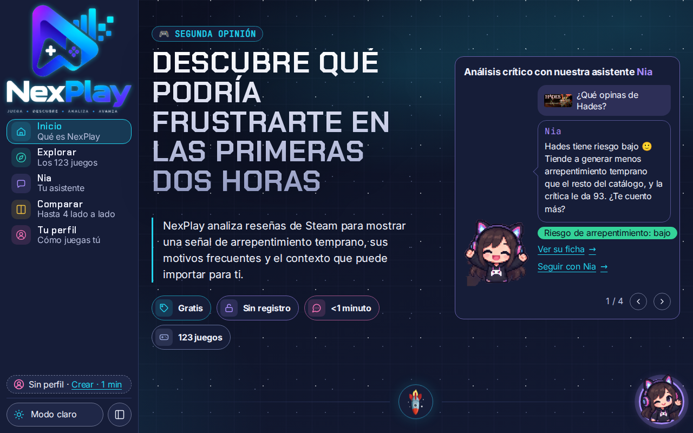
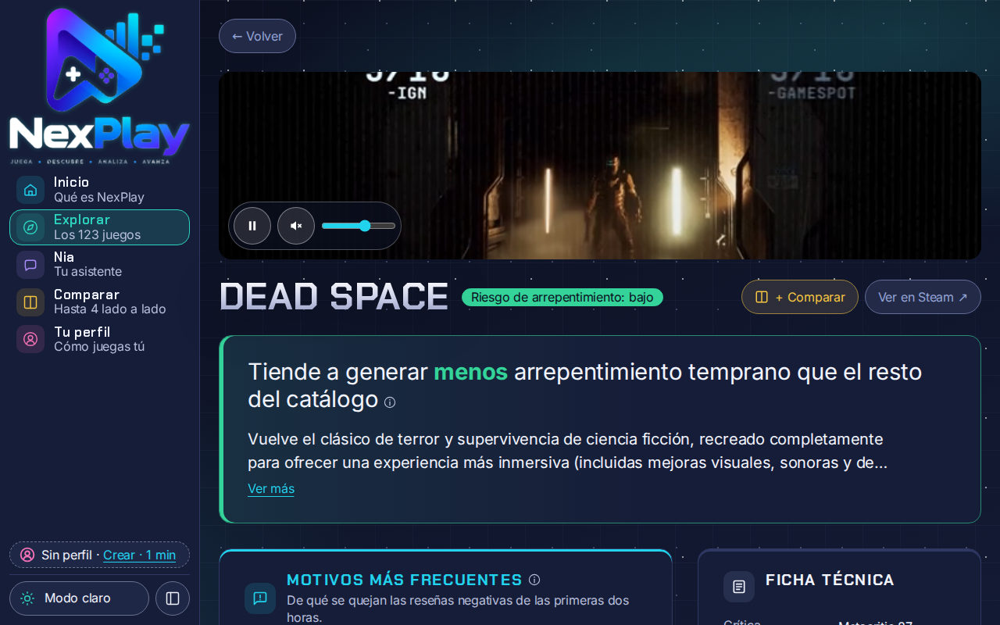
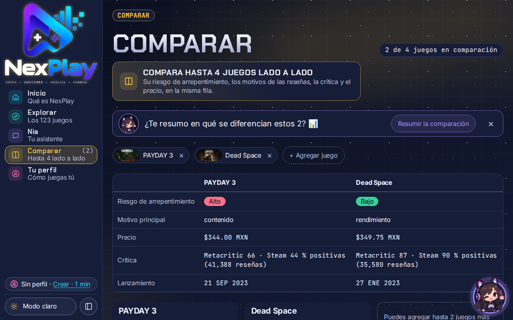
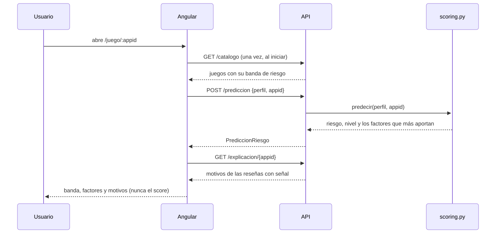

# NexPlay

**Una segunda opinión antes de comprar tu próximo juego.** NexPlay estima qué tan seguido un juego deja la
señal de arrepentimiento temprano, las reseñas negativas de Steam escritas en las primeras dos horas, y te dice
por qué, con los motivos que aparecen en reseñas reales y no con una nota genérica. Es el proyecto del Módulo V
del Diplomado en Ciencia de Datos de la FES Acatlán (UNAM).

[](https://colab.research.google.com/github/fernandoaxelramirezgomez-coder/nexplay/blob/master/notebooks/00_exploracion.ipynb)
[](https://colab.research.google.com/github/fernandoaxelramirezgomez-coder/nexplay/blob/master/notebooks/01_modelo_riesgo.ipynb)
[](https://colab.research.google.com/github/fernandoaxelramirezgomez-coder/nexplay/blob/master/notebooks/02_modelos_texto.ipynb)
[](#-requisitos-previos)
[](frontend/README.md)

**Pruébalo:** [la app en vivo](https://nexplay-six.vercel.app) · [la API y su contrato (/docs)](https://nexplay-api-345o.onrender.com/docs) · [📄 Documento final](https://github.com/fernandoaxelramirezgomez-coder/nexplay/blob/master/entregables/documento-entregafinal.pdf) · [🎤 Presentación](https://github.com/fernandoaxelramirezgomez-coder/nexplay/blob/master/entregables/presentacion-entregafinal.pdf).
La API está en el plan gratis de Render y se duerme cuando nadie la usa, así que la primera carga puede tardar
un poco.

## Entregables

| Entregable | Ver en línea | Descargar |
|---|---|---|
| 📄 Documento final | [Abrir PDF](https://github.com/fernandoaxelramirezgomez-coder/nexplay/blob/master/entregables/documento-entregafinal.pdf) | [Descargar](https://github.com/fernandoaxelramirezgomez-coder/nexplay/raw/master/entregables/documento-entregafinal.pdf) |
| 🎤 Presentación (PDF) | [Abrir PDF](https://github.com/fernandoaxelramirezgomez-coder/nexplay/blob/master/entregables/presentacion-entregafinal.pdf) | [Descargar](https://github.com/fernandoaxelramirezgomez-coder/nexplay/raw/master/entregables/presentacion-entregafinal.pdf) |
| 💡 El nicho en simples palabras | [nicho.md](entregables/nicho.md) | — |

> **Steam te dice si un juego es bueno. NexPlay te dice cuáles van contigo y cuáles suelen fallar en las primeras
> dos horas, antes de pagar.** [El nicho completo](entregables/nicho.md)

> **En 30 segundos**
>
> - **El problema:** comprar un juego en Steam que te decepciona en las primeras horas, cuando todavía lo puedes devolver.
> - **Qué estima:** para cada uno de los 123 juegos del catálogo, un riesgo de arrepentimiento (bajo, medio o
>   alto), según qué tan seguido deja la señal de arrepentimiento temprano, con los factores que lo mueven y los
>   motivos de queja de las reseñas.
> - **Qué tan bien:** PR-AUC de 0.0694 ± 0.0415 con GroupKFold por juego, 3.2 veces el clasificador trivial. En
>   40 juegos que el modelo no vio, 0.0356 contra 0.0234, 1.5 veces el trivial.
> - **Qué no hace:** no predice lo que vas a sentir tú (el riesgo es del juego), no es una probabilidad y no te
>   dice si comprar.



<table>
  <tr>
    <td width="50%"></td>
    <td width="50%"></td>
  </tr>
  <tr>
    <td align="center">La ficha de Dead Space</td>
    <td align="center">PAYDAY 3 contra Dead Space, en Comparar</td>
  </tr>
</table>

## 📑 Índice

- [Entregables](#entregables)
- [Qué es NexPlay](#-qué-es-nexplay)
- [Arquitectura](#%EF%B8%8F-arquitectura)
- [Requisitos previos](#-requisitos-previos)
- [Puesta en marcha](#-puesta-en-marcha)
- [Configuración (.env)](#%EF%B8%8F-configuración-env)
- [API](#-api)
- [Calidad](#-calidad)
- [Estructura del repositorio](#%EF%B8%8F-estructura-del-repositorio)
- [Datos y releases](#-datos-y-releases)
- [Despliegue](#%EF%B8%8F-despliegue)
- [Contenido de usuarios y moderación](#-contenido-de-usuarios-y-moderación)
- [Solución de problemas](#%EF%B8%8F-solución-de-problemas)
- [Autor y datos](#-autor-y-datos)

## 🎮 Qué es NexPlay

Steam te devuelve el dinero de un juego si lo pides dentro de los 14 días posteriores a la compra y con menos
de 2 horas jugadas. NexPlay se fija en ese límite de 2 horas: una reseña negativa escrita antes de los 120
minutos de juego es una **señal de arrepentimiento temprano** (`Y = 1` si `playtime_at_review < 120` y
`voted_up == 0`). Los 14 días no se pueden usar, porque las reseñas no dicen cuándo se compró el juego.

Es una señal proxy. Steam no le pregunta a nadie si se arrepintió, así que el proyecto nunca dice que alguien
lo hizo.

- **Los datos.** Salen de la API pública de Steam: las reseñas, de `appreviews`, y el precio, la gratuidad y
  la nota de Metacritic de cada juego, de `appdetails`. Todo está publicado en releases con tag fijo. El
  modelo se entrena siempre con data-v1 (83 juegos, 123,972 reseñas). La app sirve 123 juegos (data-v3), y
  los 40 que no están en data-v1 son la prueba externa: nunca entran al entrenamiento.
- **El modelo.** Es una regresión logística con variables del juego: gratuidad, precio, descuento y cobertura
  y nota de la crítica. El riesgo es del juego, el mismo para cualquier persona. Se valida con GroupKFold por
  `appid`, porque tiene que funcionar con juegos que no vio, y se mide con PR-AUC, porque la señal aparece en
  pocas reseñas: 0.0694 ± 0.0415 entre folds, 3.2 veces el clasificador trivial. En los 40 externos da 0.0356
  contra 0.0234 del trivial.
- **La app.** Te muestra la banda de riesgo (bajo, medio o alto, nunca un número), los factores que más la
  mueven, los motivos de queja más frecuentes y a Nia, un chat que te explica los datos del juego sin
  recomendarte que lo compres. El perfil que declares sirve para contarte qué tanto encaja un juego contigo;
  no cambia el riesgo.

La historia completa está en tres notebooks que corren en Colab: `00_exploracion` (los datos, antes del
modelo), `01_modelo_riesgo` (el modelo) y `02_modelos_texto` (si el texto distingue las negativas
tempranas). Los detalles, en [notebooks/README.md](notebooks/README.md).

## 🏗️ Arquitectura

<picture>
  <source media="(prefers-color-scheme: dark)" srcset="docs/diagramas/01-arquitectura.svg">
  
</picture>

<sub>Fuente: [docs/diagramas/01-arquitectura.mmd](docs/diagramas/01-arquitectura.mmd)</sub>

En producción, Render construye la API con `backend/despliegue/Dockerfile`: baja los datos, entrena el modelo
y, si alguna de las 123 bandas cambia, el build falla. Vercel publica el frontend.

Esto es lo que pasa cuando abres la ficha de un juego:

<picture>
  <source media="(prefers-color-scheme: dark)" srcset="docs/diagramas/02-ficha-de-un-juego.svg">
  
</picture>

<sub>Fuente: [docs/diagramas/02-ficha-de-un-juego.mmd](docs/diagramas/02-ficha-de-un-juego.mmd)</sub>

## 🧰 Requisitos previos

| Herramienta | Versión | Para qué |
|---|---|---|
| Python | 3.12 o más nuevo (probado con 3.14, la del Dockerfile) | backend, modelo y notebooks |
| Node.js con npm | `^22.22.3`, `^24.15.0` o `>=26` | frontend |
| git | cualquiera reciente | clonar; `make notebooks` exporta el último commit |
| make | GNU make | la opción A (Linux, macOS o WSL) |
| Chrome | opcional | las gráficas del 00 en PNG y las capturas de la UI |
| Clave de OpenAI | opcional | Nia con modelo; sin clave responde con reglas |
| LaTeX (latexmk, LuaLaTeX y biber) | opcional | compilar el documento con `make doc` |

No necesitas cuenta ni credenciales de Steam ni de GitHub: todo lo que se descarga es público. La instalación
base con los datos ocupa algo más de 1 GB (`.venv` 575 MB, `node_modules` 366 MB y los datos 102 MB). Si
además corres los notebooks, sus paquetes (torch CPU, lingua y transformers, entre otros) suman otros 1.6 GB.

## 🚀 Puesta en marcha

### Opción A: con make

```bash
git clone https://github.com/fernandoaxelramirezgomez-coder/nexplay.git
cd nexplay

make setup       # .venv con backend/requirements*.txt y npm ci en frontend/
make data        # baja data-v3 y data-v1 a backend/datos/ y verifica su sha256
make train       # entrena backend/modelo/nexplay.pkl y compara las 123 bandas con la referencia

make api         # terminal 1: API en http://localhost:8000 (contrato en /docs)
make web         # terminal 2: frontend en http://localhost:4200

make test        # verificadores del backend y pruebas del frontend
make notebooks   # opcional: ejecuta el 00, el 01 y el 02 y los compara con las salidas guardadas
```

Si corres `make` sin objetivo, te muestra la lista. Cada objetivo revisa antes lo que necesita: si falta
`.venv`, las bases o el modelo, te dice qué correr primero. Abre el frontend como `localhost` y no como
`127.0.0.1`, porque el CORS de la API solo permite `http://localhost:4200`.

### Opción B: manual, paso a paso

```bash
git clone https://github.com/fernandoaxelramirezgomez-coder/nexplay.git
cd nexplay

python3 -m venv .venv
source .venv/bin/activate            # en Windows: .venv\Scripts\activate
pip install -r backend/requirements.txt -r backend/requirements-modelo.txt

cd backend
python despliegue/preparar_entorno.py      # baja los datos, entrena y prueba que la API responda
python modelado/verificar_bandas.py        # las 123 bandas, idénticas a la referencia
uvicorn api.main:app --reload              # http://localhost:8000

# en otra terminal, desde la raíz del repo
cd frontend
npm ci
npx ng serve                               # http://localhost:4200
```

`preparar_entorno.py` no pisa lo que ya existe. Con `--force` reconstruye, pero solo las bases que salieron de
un release. Todos los comandos de Python corren desde `backend/`.

### Opción C: los notebooks en Colab

| Notebook | Abrir |
|---|---|
| `00_exploracion`: valida, limpia y explora los datos | [](https://colab.research.google.com/github/fernandoaxelramirezgomez-coder/nexplay/blob/master/notebooks/00_exploracion.ipynb) |
| `01_modelo_riesgo`: construye y mide el modelo | [](https://colab.research.google.com/github/fernandoaxelramirezgomez-coder/nexplay/blob/master/notebooks/01_modelo_riesgo.ipynb) |
| `02_modelos_texto`: si el texto distingue las negativas tempranas | [](https://colab.research.google.com/github/fernandoaxelramirezgomez-coder/nexplay/blob/master/notebooks/02_modelos_texto.ipynb) |

Abre cualquiera de los tres y usa *Entorno de ejecución → Ejecutar todas*. Cada notebook clona el tag
`codigo-v8` y baja los datos verificando su sha256, así que no necesitas nada de lo anterior y no te pide
credenciales.

Los tres corrieron en Colab el 2026-10-02 con `codigo-v8`, el tag de entrega, sin errores ni avisos; evidencia en
[docs/evidencia/colab/](docs/evidencia/colab/README.md), junto con las corridas anteriores (`codigo-v3`, `codigo-v4`
y `codigo-v6`). Los tres guardan en `notebooks/` las salidas de
una corrida local, para que sus gráficas también se vean como PNG en GitHub.

## ⚙️ Configuración (.env)

Si quieres que Nia use un modelo de lenguaje, copia la plantilla en la raíz y llena la clave:

```bash
cp .env.example .env
```

`.env` está en `.gitignore`, y la clave nunca va en un archivo del repo; en Render se carga en *Environment*.
La API lee el `.env` de la raíz aunque corra desde `backend/`, pero solo para las variables de Nia. Las demás
las toma del entorno del proceso: expórtalas en la terminal antes de `make api` o ponlas en el panel de Render.

| Variable | Por omisión | Qué hace | Se lee de |
|---|---|---|---|
| `OPENAI_API_KEY` | vacía | La clave del chat de Nia. Vacía, Nia responde en modo demostración, con reglas. | `.env` o entorno |
| `NEXPLAY_MODELO_NIA` | vacío | El modelo de OpenAI de Nia. Vacío, también modo demostración. | `.env` o entorno |
| `NEXPLAY_NIA_MAX_TOKENS` | 400 | El largo máximo de la respuesta. | `.env` o entorno |
| `NEXPLAY_NIA_TIMEOUT` | 20 | Segundos de espera al modelo. | `.env` o entorno |
| `NEXPLAY_NIA_POR_MINUTO` | 10 | Mensajes a Nia por minuto, por usuario e IP. | `.env` o entorno |
| `NEXPLAY_NIA_RAZONAMIENTO` | false | En true, pide 1,200 tokens y esfuerzo bajo (para un modelo de razonamiento). | `.env` o entorno |
| `NEXPLAY_CORS_ORIGENES` | vacío | Orígenes extra separados por coma. `http://localhost:4200` siempre está permitido. | entorno |
| `NEXPLAY_VALORACIONES_DB` | `backend/datos/valoraciones.db` | Dónde guardar calificaciones, comentarios y votos. | entorno |
| `NEXPLAY_COMENTARIOS_POR_MINUTO` | 3 | Comentarios por minuto, por usuario e IP. | entorno |
| `NEXPLAY_REACCIONES_POR_MINUTO` | 30 | Reacciones por minuto. | entorno |
| `NEXPLAY_VOTOS_NIA_POR_MINUTO` | 30 | Votos a respuestas de Nia por minuto. | entorno |

## 🔌 API

Con la API levantada, tienes el contrato completo en http://localhost:8000/docs. Qué significa cada campo, con
ejemplos, lo explica [backend/api/README.md](backend/api/README.md).

| Método y ruta | Qué hace |
|---|---|
| `GET /catalogo?q=` | Busca juegos por nombre; sin `q`, el catálogo completo con la banda de cada uno. |
| `GET /estado` | El sistema de un vistazo: si Nia usa OpenAI, el release de datos, cuántos juegos y con qué modelo de riesgo. Sin la clave. |
| `GET /panorama` | Cuántas reseñas hay detrás del catálogo, de cuándo son y cuántas traen la señal. |
| `POST /perfil` | Recibe el formulario de alta y devuelve el perfil derivado. |
| `POST /prediccion` | Recibe perfil y `appid`; devuelve riesgo, nivel y los factores que más aportan. |
| `GET /explicacion/{appid}` | Los motivos de queja más frecuentes en las reseñas con señal de ese juego. |
| `GET`, `PUT` y `DELETE /valoraciones/{appid}` | La calificación de 1 a 5 de la segunda opinión: leerla, ponerla o quitarla. |
| `GET` y `POST /comentarios/{appid}` | El hilo público de comentarios del juego. |
| `PUT` y `DELETE /comentarios/{appid}/{id}` | Editar o borrar un comentario propio. |
| `PUT /comentarios/{appid}/{id}/reaccion` | Pulgar arriba a un comentario, en toggle. |
| `POST /nia` | El chat de Nia, sobre un juego o sobre el catálogo. |
| `GET /nia/opiniones?appids=` | La opinión corta de Nia sobre hasta 6 juegos, sin modelo de lenguaje. |
| `PUT` y `DELETE /nia/valoracion/{id}` | El 👍 o 👎 a una respuesta de Nia. |

Por ejemplo, así pides el riesgo de Hades:

```bash
PERFIL=$(curl -s -X POST http://localhost:8000/perfil -H 'Content-Type: application/json' \
  -d '{"compras_al_anio": 3, "horas_por_semana": 6, "tolerancia_friccion": 3,
       "tags_preferidos": ["Roguelike"], "tags_rechazados": [], "plataforma": "pc"}')
curl -s -X POST http://localhost:8000/prediccion -H 'Content-Type: application/json' \
  -d "{\"perfil\": $PERFIL, \"appid\": 1145360}"
```

`riesgo` ordena los juegos de más a menos riesgo, pero no es una probabilidad calibrada. Por eso la app solo
muestra `nivel`, que sale de los terciles de los scores de validación.

## ✅ Calidad

| Comando | Qué revisa |
|---|---|
| `make test` | Que las 123 bandas sean las de `backend/referencias/bandas_referencia.json`. También revisa a Nia (contexto, reglas y votos, sin gastar llamadas), las nueve reglas de «Qué mueve esta estimación», que `preparar_entorno --force` no pise bases ajenas y las 279 pruebas del frontend. |
| `make notebooks` | Ejecuta el 00, el 01 y el 02 con el último commit y compara cada salida con la guardada, sin sobrescribirla. Falla si un notebook no termina; las celdas distintas las lista con su diff. |
| `cd frontend && npx ng build` | El build de producción del frontend. |
| `python calidad/capturar_ui.py`, desde `backend/` | Recorre la UI con Playwright (API y frontend corriendo), guarda capturas en `docs/capturas/angular/` y reporta problemas de texto y contraste. |
| `python calidad/preguntas_nia.py --api http://localhost:8000 --etiqueta prueba`, desde `backend/` | Las 25 preguntas a Nia contra una API levantada. |
| El build de Render | Corre `preparar_entorno.py` y `verificar_bandas.py`; falla si una banda cambia o si llega torch a la imagen. |

Cada decisión que se midió (por qué no se entrena con los 123, qué pasa con otra partición, la señal por
banda) está en [docs/evidencia/](docs/evidencia/README.md), con el script que la reproduce en
`backend/calidad/`.

## 🗂️ Estructura del repositorio

```
nexplay/
├── README.md            este archivo
├── Makefile             make help lista los objetivos
├── .env.example         plantilla de variables; el .env real no se versiona
├── CLAUDE.md · AGENTS.md  decisiones y convenciones del proyecto
├── entregables/         lo que se califica: el nicho, la presentación y el documento final
├── notebooks/           00_exploracion, 01_modelo_riesgo y 02_modelos_texto, con su ruta de ejecución
├── backend/             todo el Python; los comandos corren desde aquí
│   ├── api/               FastAPI: endpoints, esquemas, scoring y el chat de Nia (nia/)
│   ├── modelado/          entrenamiento y comparación de bandas
│   ├── analisis/          cuentas del EDA y del texto; motivos.py lo usa la API
│   ├── referencias/       bandas validadas y partición congelada
│   ├── despliegue/        preparar_entorno.py, utilidades.py y el Dockerfile de Render
│   ├── calidad/           verificadores y scripts de evidencia
│   ├── ingesta/           la ingesta original desde Steam
│   ├── publicacion/       lo que se sube a un release
│   ├── operacion/         exportar y moderar comentarios
│   └── requirements*.txt  uno por uso (ver backend/README.md)
├── frontend/            Angular: src/, public/, fuentes/ (la hoja de Nia) y scripts/
├── documento/           solo la fuente LaTeX del documento final (make doc)
└── docs/                evidencia, capturas, diseño e historial
```

Cada carpeta tiene un `README.md` corto que dice qué va ahí y qué no. Cuando corres el proyecto aparecen, sin
versionarse, `backend/datos/`, `backend/modelo/`, `backend/extracto/` y `backend/registros/`. El documento
final está en LaTeX, en `documento/`: `make doc` genera sus figuras y cifras, lo compila y deja el PDF en
`entregables/documento-entregafinal.pdf`.

## 💾 Datos y releases

| Release | Qué trae | Para qué |
|---|---|---|
| `data-v1` | 83 juegos y 123,972 reseñas | Entrenar y medir el modelo; todas las decisiones. |
| `data-v2` | 123 juegos | Los 40 títulos que no están en data-v1 son la prueba externa del 01. |
| `data-v3` | Los juegos y reseñas de data-v2, más los totales públicos de Steam (`resumen_resenas`) | Lo que sirve la API. |

Cada release trae `nexplay_reproducible.db.xz`, una copia sanitizada de la base sin la columna `steamid`, y
`nexplay_extracto.parquet`, un extracto sin texto para el 01. Antes de abrirlos se verifica su sha256
(`descargar_verificado`, en `backend/despliegue/utilidades.py`).

**Regenerar un release (solo mantenedores).** Solo hace falta si vuelves a ingestar Steam o cambia el esquema.
Desde `backend/`:

```bash
python ingesta/ingesta_steam.py --catalogo
python ingesta/ingesta_steam.py --resenas          # tarda horas; reanuda si se interrumpe

python publicacion/extracto_datos.py               # extracto/nexplay_extracto.parquet
python publicacion/extracto_reproducible.py        # extracto/nexplay_reproducible.db.xz
gh release create data-v4 extracto/nexplay_extracto.parquet extracto/nexplay_reproducible.db.xz
```

Cada extracto nuevo va con un tag nuevo; nunca se reemplazan los assets de uno publicado. Después pones los
sha256 que imprime cada script en `backend/despliegue/preparar_entorno.py` (`SERVIDO_SHA256` y
`ENTRENAMIENTO_SHA256`) y en los notebooks. Si no coinciden, la descarga se rechaza a propósito.

## ☁️ Despliegue

- **API en Render**, como servicio Docker, en https://nexplay-api-345o.onrender.com. Su configuración:
  - Root Directory: `backend`
  - Dockerfile Path: `despliegue/Dockerfile`
  - Docker Build Context Directory: `.` (un solo punto, la misma carpeta `backend/`)

  El build instala `requirements.txt` y `requirements-modelo.txt` (sin pyarrow), baja los datos, entrena y
  corre `verificar_bandas.py`. Los Build Filters incluyen solo lo que copia el Dockerfile, así que cambiar un
  README no dispara un deploy.
- **Frontend en Vercel**, con Root Directory `frontend`, en https://nexplay-six.vercel.app.
  `frontend/vercel.json` reescribe toda ruta a `index.html`, y `frontend/src/environments/environment.ts`
  apunta a la API de Render. El origen de Vercel se agrega a la API con `NEXPLAY_CORS_ORIGENES`.

En el plan gratis de Render el disco es efímero: `valoraciones.db` se borra cada vez que el servicio se
reinicia.

## 💬 Contenido de usuarios y moderación

Las calificaciones, los comentarios y los votos a Nia viven en `backend/datos/valoraciones.db`, aparte del
catálogo. No salen de ningún release: `make data` no los toca, y respaldarlos es copiar el archivo. La
identidad es un id anónimo que genera el navegador. Identifica, pero no autentica, así que no sirve como
control de acceso.

Desde `backend/`:

- `python operacion/exportar_valoraciones.py` deja dos CSV en `extracto/`, uno de calificaciones y otro de
  comentarios.
- `python operacion/moderar_comentarios.py [appid]` lista los comentarios, y `--borrar ID` elimina uno con sus
  reacciones. Es la única forma de borrar el comentario de otra persona.

## 🛠️ Solución de problemas

| Síntoma | Causa | Qué hacer |
|---|---|---|
| `make` dice «Falta el entorno .venv», «Faltan las bases» o «Falta el modelo» | Un paso anterior no se corrió. | Corre lo que indica, en orden: `make setup`, `make data`, `make train`. |
| `make setup` dice que hace falta Python 3.12 | `python3` es más viejo (numpy 2.5 pide 3.12). | `make setup PYTHON=python3.14`, o el Python 3.12+ que tengas. |
| El frontend carga pero no trae juegos | Lo abriste como `127.0.0.1`, o la API no está corriendo. | Ábrelo como `http://localhost:4200` y revisa que `make api` siga arriba. |
| `make api` dice que el puerto 8000 está en uso | Ya hay otra API corriendo. | Apágala, o usa `make api PUERTO=8001` (el frontend en desarrollo espera el 8000). |
| `preparar_entorno.py --force` dice «No piso …» | Esa base no salió de un release (por ejemplo, la base original de la ingesta). | Respáldala o muévela y vuelve a correr. Es a propósito: esa base no se recupera de un release. |
| «sha256 … no coincide» al bajar datos | El asset cambió o la descarga se cortó. | Vuelve a intentar. Si persiste, no sigas: el release no es el esperado. |
| `npm install` falla con `Cannot read properties of null (reading 'edgesOut')` | Un bug de npm 10.9 con las dependencias de Vitest. | Usa `npm ci` (es lo que hace `make setup`). Para regenerar el lockfile, `npx npm@11.19.1 install`. |
| El 00 avisa «Exportación estática apagada» | En Colab, o kaleido no encuentra un Chrome. | Nada que arreglar: las gráficas se ven interactivas. Para tener PNG en local, `.venv/bin/plotly_get_chrome` o `BROWSER_PATH`. |
| `make notebooks` lista celdas distintas | Las salidas guardadas salieron de otro entorno (Colab, otra versión de pandas). | Revisa el diff que imprime: si solo cambia cómo se escribe un tipo o el orden de un empate, no es una cifra distinta. No hace fallar el comando. |
| El build de Render falla con «torch o sentence-transformers en la imagen» | Algo agregó un paquete de notebooks a los requirements de la API. | Esos paquetes van solo en `backend/requirements-notebooks.txt`. |
| Vienes de la estructura anterior y la API no encuentra los datos | `datos/`, `modelo/`, `extracto/` y `registros/` ahora viven en `backend/`. | Muévelas: `mv datos modelo extracto registros backend/`. |

## 👤 Autor y datos

Fernando Axel Ramírez Gómez, Diplomado en Ciencia de Datos, FES Acatlán (UNAM).

Los datos vienen de la API pública de Steam: las reseñas, de `appreviews`, y el precio, la gratuidad y la
nota de Metacritic de cada juego, de `appdetails`. La nota de Metacritic es la que muestra Steam.
