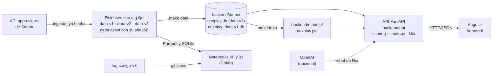
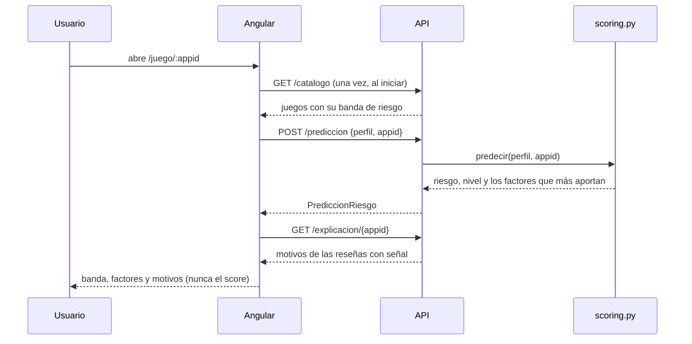

# NexPlay

**Una segunda opinión antes de comprar tu próximo juego.** NexPlay estima el riesgo de arrepentirte
pronto de una compra en Steam y te dice por qué, con los motivos que aparecen en reseñas reales en lugar
de una nota genérica. Es el proyecto del Módulo V del Diplomado en Ciencia de Datos de la FES Acatlán
(UNAM).


## Índice

- [Qué es NexPlay](#qué-es-nexplay)
- [Arquitectura](#arquitectura)
- [Requisitos previos](#requisitos-previos)
- [Puesta en marcha](#puesta-en-marcha)
- [Configuración (.env)](#configuración-env)
- [API](#api)
- [Calidad](#calidad)
- [Estructura del repositorio](#estructura-del-repositorio)
- [Datos y releases](#datos-y-releases)
- [Despliegue](#despliegue)
- [Contenido de usuarios y moderación](#contenido-de-usuarios-y-moderación)
- [Solución de problemas](#solución-de-problemas)

## Qué es NexPlay

Steam devuelve el dinero de un juego si lo pides antes de jugar 120 minutos. NexPlay toma esa ventana
como referencia: una reseña negativa escrita antes de los 120 minutos es una **señal de arrepentimiento
temprano** (`Y = 1` si `playtime_at_review < 120` y `voted_up == 0`). Es una proxy. Steam no pregunta a
nadie si se arrepintió, así que el proyecto nunca afirma que alguien lo hizo.

- **Datos.** Reseñas de la API pública `appreviews` de Steam, publicadas en releases con tag fijo. El
  modelo se entrena siempre con data-v1 (83 juegos, 123,972 reseñas). La app sirve 123 juegos (data-v3);
  los 40 que no están en data-v1 son prueba externa y nunca entran al entrenamiento.
- **Modelo.** Una regresión logística con variables del juego: gratuidad, precio, descuento y cobertura y
  nota de la crítica. El riesgo es del juego, igual para cualquier persona. Se valida con GroupKFold por
  `appid`, porque tiene que funcionar con juegos que no vio, y se mide con PR-AUC, porque la clase es
  rara: 0.0694 ± 0.0415 entre folds, 3.2 veces el clasificador trivial. En los 40 externos da 0.0356
  contra 0.0234 del trivial.
- **La app.** Muestra la banda de riesgo (bajo, medio o alto, nunca un número), los factores que más la
  mueven, los motivos de queja más frecuentes y a Nia, un chat que explica los datos del juego sin
  recomendar la compra. El perfil que declaras sirve para contarte qué tanto encaja un juego contigo; no
  cambia el riesgo.

La narrativa completa está en dos notebooks que corren en Colab: `00_exploracion` (los datos, antes del
modelo) y `01_modelo_riesgo` (el modelo). Ver [notebooks/README.md](notebooks/README.md).

## Arquitectura


```mermaid
flowchart LR
    steam["API appreviews<br/>de Steam"] -->|ingesta, ya hecha| releases["Releases con tag fijo<br/>data-v1 · data-v2 · data-v3<br/>cada asset con su sha256"]
    releases -->|make data| datos[("backend/datos/<br/>nexplay.db (data-v3)<br/>nexplay_data-v1.db")]
    datos -->|make train| modelo["backend/modelo/<br/>nexplay.pkl"]
    datos --> api["API FastAPI<br/>backend/api<br/>scoring · catálogo · Nia"]
    modelo --> api
    openai["OpenAI<br/>(opcional)"] -.->|chat de Nia| api
    api -->|HTTP/JSON| web["Angular<br/>frontend/"]
    releases -->|Parquet y SQLite| nb["Notebooks 00 y 01<br/>(Colab)"]
    tag["tag codigo-v3"] -->|git clone| nb
```

En producción, Render construye la API con `backend/despliegue/Dockerfile`. El build baja los datos,
entrena el modelo y falla si alguna de las 123 bandas cambia. Vercel publica el frontend.

Lo que pasa al abrir la ficha de un juego:


```mermaid
sequenceDiagram
    participant U as Usuario
    participant W as Angular
    participant A as API
    participant S as scoring.py
    U->>W: abre /juego/:appid
    W->>A: GET /catalogo (una vez, al iniciar)
    A-->>W: juegos con su banda de riesgo
    W->>A: POST /prediccion {perfil, appid}
    A->>S: predecir(perfil, appid)
    S-->>A: riesgo, nivel y los factores que más aportan
    A-->>W: PrediccionRiesgo
    W->>A: GET /explicacion/{appid}
    A-->>W: motivos de las reseñas con señal
    W-->>U: banda, factores y motivos (nunca el score)
```

## Requisitos previos

| Herramienta | Versión | Para qué |
|---|---|---|
| Python | 3.12 o más nuevo (probado con 3.14, la del Dockerfile) | backend, modelo y notebooks |
| Node.js con npm | `^22.22.3`, `^24.15.0` o `>=26` | frontend |
| git | cualquiera reciente | clonar; `make notebooks` exporta el último commit |
| make | GNU make | la opción A (Linux, macOS o WSL) |
| Chrome | opcional | las gráficas del 00 en PNG y las capturas de la UI |
| Clave de OpenAI | opcional | Nia con modelo; sin clave responde con reglas |

No hace falta cuenta ni credenciales de Steam ni de GitHub: todo lo que se descarga es público. La
instalación base con los datos ocupa algo más de 1 GB (`.venv` 575 MB, `node_modules` 366 MB y los datos
102 MB). Los paquetes de los notebooks (torch CPU, lingua y transformers, entre otros) suman otros 1.6 GB.

## Puesta en marcha

### Opción A: con make

```bash
git clone https://github.com/fernandoaxelramirezgomez-coder/nexplay.git
cd nexplay

make setup       # .venv con backend/requirements*.txt y npm ci en frontend/
make data        # baja data-v3 y data-v1 a backend/datos/ y verifica su sha256
make train       # entrena backend/modelo/nexplay.pkl y compara las 123 bandas con la referencia

make api         # terminal 1: API en http://localhost:8000 (contrato en /docs)
make web         # terminal 2: frontend en http://localhost:4200

make test        # verificadores del backend y pruebas del frontend
make notebooks   # opcional: ejecuta el 00 y el 01 y los compara con las salidas guardadas
```

`make` sin objetivo muestra la lista. Cada objetivo revisa antes lo que necesita: si falta `.venv`, las
bases o el modelo, te dice qué correr primero. Abre el frontend como `localhost`, no como `127.0.0.1`:
el CORS de la API solo permite `http://localhost:4200`.

### Opción B: manual, paso a paso

```bash
git clone https://github.com/fernandoaxelramirezgomez-coder/nexplay.git
cd nexplay

python3 -m venv .venv
source .venv/bin/activate            # en Windows: .venv\Scripts\activate
pip install -r backend/requirements.txt -r backend/requirements-modelo.txt

cd backend
python despliegue/preparar_entorno.py      # baja los datos, entrena y prueba que la API responda
python modelado/verificar_bandas.py        # las 123 bandas, idénticas a la referencia
uvicorn api.main:app --reload              # http://localhost:8000

# en otra terminal, desde la raíz del repo
cd frontend
npm ci
npx ng serve                               # http://localhost:4200
```

`preparar_entorno.py` no pisa lo que ya existe; `--force` reconstruye, pero solo sobre bases que salieron
de un release. Todos los comandos de Python corren desde `backend/`.

### Opción C: los notebooks en Colab

| Notebook | Abrir |
|---|---|
| `00_exploracion`: valida, limpia y explora los datos | [](https://colab.research.google.com/github/fernandoaxelramirezgomez-coder/nexplay/blob/master/notebooks/00_exploracion.ipynb) |
| `01_modelo_riesgo`: construye y mide el modelo | [](https://colab.research.google.com/github/fernandoaxelramirezgomez-coder/nexplay/blob/master/notebooks/01_modelo_riesgo.ipynb) |

Abre cada uno y usa *Entorno de ejecución → Ejecutar todas*. Cada notebook clona el tag `codigo-v3` y baja
los datos verificando su sha256, así que no necesita nada de lo anterior ni pide credenciales.

## Configuración (.env)

Para usar Nia con un modelo de lenguaje, copia la plantilla en la raíz y llena la clave:

```bash
cp .env.example .env
```

`.env` está en `.gitignore` y la clave nunca va en un archivo del repo; en Render se carga en
*Environment*. La API lee el `.env` de la raíz aunque corra desde `backend/`, pero solo para las variables
de Nia. Las demás se leen del entorno del proceso: expórtalas en la terminal antes de `make api`, o ponlas
en el panel de Render.

| Variable | Por omisión | Qué hace | Se lee de |
|---|---|---|---|
| `OPENAI_API_KEY` | vacía | La clave del chat de Nia. Vacía, Nia responde en modo demostración, con reglas. | `.env` o entorno |
| `NEXPLAY_MODELO_NIA` | vacío | El modelo de OpenAI de Nia. Vacío, también modo demostración. | `.env` o entorno |
| `NEXPLAY_NIA_MAX_TOKENS` | 400 | El largo máximo de la respuesta. | `.env` o entorno |
| `NEXPLAY_NIA_TIMEOUT` | 20 | Segundos de espera al modelo. | `.env` o entorno |
| `NEXPLAY_NIA_POR_MINUTO` | 10 | Mensajes a Nia por minuto, por usuario e IP. | `.env` o entorno |
| `NEXPLAY_NIA_RAZONAMIENTO` | false | En true, pide 1,200 tokens y esfuerzo bajo (para un modelo de razonamiento). | `.env` o entorno |
| `NEXPLAY_CORS_ORIGENES` | vacío | Orígenes extra separados por coma. `http://localhost:4200` siempre está permitido. | entorno |
| `NEXPLAY_VALORACIONES_DB` | `backend/datos/valoraciones.db` | Dónde guardar calificaciones, comentarios y votos. | entorno |
| `NEXPLAY_COMENTARIOS_POR_MINUTO` | 3 | Comentarios por minuto, por usuario e IP. | entorno |
| `NEXPLAY_REACCIONES_POR_MINUTO` | 30 | Reacciones por minuto. | entorno |
| `NEXPLAY_VOTOS_NIA_POR_MINUTO` | 30 | Votos a respuestas de Nia por minuto. | entorno |

## API

Con la API levantada, el contrato completo está en http://localhost:8000/docs. Qué significa cada campo,
con ejemplos, está en [backend/api/README.md](backend/api/README.md).

| Método y ruta | Qué hace |
|---|---|
| `GET /catalogo?q=` | Busca juegos por nombre; sin `q`, el catálogo completo con la banda de cada uno. |
| `GET /panorama` | Cuántas reseñas hay detrás del catálogo, de cuándo son y cuántas traen la señal. |
| `POST /perfil` | Recibe el formulario de alta y devuelve el perfil derivado. |
| `POST /prediccion` | Recibe perfil y `appid`; devuelve riesgo, nivel y los factores que más aportan. |
| `GET /explicacion/{appid}` | Los motivos de queja más frecuentes en las reseñas con señal de ese juego. |
| `GET`, `PUT` y `DELETE /valoraciones/{appid}` | La calificación de 1 a 5 de la segunda opinión: leerla, ponerla o quitarla. |
| `GET` y `POST /comentarios/{appid}` | El hilo público de comentarios del juego. |
| `PUT` y `DELETE /comentarios/{appid}/{id}` | Editar o borrar un comentario propio. |
| `PUT /comentarios/{appid}/{id}/reaccion` | Pulgar arriba a un comentario, en toggle. |
| `POST /nia` | El chat de Nia, sobre un juego o sobre el catálogo. |
| `GET /nia/opiniones?appids=` | La opinión corta de Nia sobre hasta 6 juegos, sin modelo de lenguaje. |
| `PUT` y `DELETE /nia/valoracion/{id}` | El 👍 o 👎 a una respuesta de Nia. |

Por ejemplo, el riesgo de Hades:

```bash
PERFIL=$(curl -s -X POST http://localhost:8000/perfil -H 'Content-Type: application/json' \
  -d '{"compras_al_anio": 3, "horas_por_semana": 6, "tolerancia_friccion": 3,
       "tags_preferidos": ["Roguelike"], "tags_rechazados": [], "plataforma": "pc"}')
curl -s -X POST http://localhost:8000/prediccion -H 'Content-Type: application/json' \
  -d "{\"perfil\": $PERFIL, \"appid\": 1145360}"
```

`riesgo` ordena los juegos de más a menos riesgo, pero no es una probabilidad calibrada. Por eso la app
muestra solo `nivel`, que sale de los terciles de los scores de validación.

## Calidad

| Comando | Qué revisa |
|---|---|
| `make test` | Que las 123 bandas sean las de `backend/referencias/bandas_referencia.json`. También revisa a Nia (contexto, reglas y votos, sin gastar llamadas), las nueve reglas de «Qué mueve esta estimación», que `preparar_entorno --force` no pise bases ajenas y las 279 pruebas del frontend. |
| `make notebooks` | Ejecuta el 00 y el 01 con el último commit y compara cada salida con la guardada, sin sobrescribirla. |
| `cd frontend && npx ng build` | El build de producción del frontend. |
| `python calidad/capturar_ui.py`, desde `backend/` | Recorre la UI con Playwright (API y frontend corriendo), guarda capturas en `docs/capturas/angular/` y reporta problemas de texto y contraste. |
| `python calidad/preguntas_nia.py --api http://localhost:8000 --etiqueta prueba`, desde `backend/` | Las 25 preguntas a Nia contra una API levantada. |
| El build de Render | Corre `preparar_entorno.py` y `verificar_bandas.py`; falla si una banda cambia o si llega torch a la imagen. |

Cada decisión medida (por qué no se entrena con los 123, qué pasa con otra partición, la señal por banda)
está en [docs/evidencia/](docs/evidencia/README.md), con el script que la reproduce en `backend/calidad/`.

## Estructura del repositorio

```
nexplay/
├── README.md            este archivo
├── Makefile             make help lista los objetivos
├── .env.example         plantilla de variables; el .env real no se versiona
├── CLAUDE.md · AGENTS.md  decisiones y convenciones del proyecto
├── backend/             todo el Python; los comandos corren desde aquí
│   ├── api/               FastAPI: endpoints, esquemas, scoring y el chat de Nia (nia/)
│   ├── modelado/          entrenamiento y comparación de bandas
│   ├── analisis/          cuentas del EDA y del texto; motivos.py lo usa la API
│   ├── referencias/       bandas validadas y partición congelada
│   ├── despliegue/        preparar_entorno.py, utilidades.py y el Dockerfile de Render
│   ├── calidad/           verificadores y scripts de evidencia
│   ├── ingesta/           la ingesta original desde Steam
│   ├── publicacion/       lo que se sube a un release
│   ├── operacion/         exportar y moderar comentarios
│   └── requirements*.txt  uno por uso (ver backend/README.md)
├── frontend/            Angular: src/, public/, fuentes/ (la hoja de Nia) y scripts/
├── notebooks/           00_exploracion y 01_modelo_riesgo, con su ruta de ejecución
└── docs/                evidencia, capturas, diseño e historial
```

Cada carpeta tiene un `README.md` corto con lo que va ahí y lo que no. Al correr aparecen, sin
versionarse, `backend/datos/`, `backend/modelo/`, `backend/extracto/` y `backend/registros/`. El documento
final en LaTeX (`documento/`) llega al fusionar su rama; mientras tanto, `make doc` solo avisa.

## Datos y releases

| Release | Qué trae | Para qué |
|---|---|---|
| `data-v1` | 83 juegos y 123,972 reseñas | Entrenar y medir el modelo; todas las decisiones. |
| `data-v2` | 123 juegos | Los 40 títulos que no están en data-v1 son la prueba externa del 01. |
| `data-v3` | Los juegos y reseñas de data-v2, más los totales públicos de Steam (`resumen_resenas`) | Lo que sirve la API. |

Cada release trae `nexplay_reproducible.db.xz`, una copia sanitizada de la base sin la columna `steamid`,
y `nexplay_extracto.parquet`, un extracto sin texto para el 01. Quien los baja verifica el sha256 antes de
abrirlos (`descargar_verificado`, en `backend/despliegue/utilidades.py`).

**Regenerar un release (solo mantenedores).** Hace falta solo si se vuelve a ingestar Steam o cambia el
esquema. Desde `backend/`:

```bash
python ingesta/ingesta_steam.py --catalogo
python ingesta/ingesta_steam.py --resenas          # tarda horas; reanuda si se interrumpe

python publicacion/extracto_datos.py               # extracto/nexplay_extracto.parquet
python publicacion/extracto_reproducible.py        # extracto/nexplay_reproducible.db.xz
gh release create data-v4 extracto/nexplay_extracto.parquet extracto/nexplay_reproducible.db.xz
```

Cada extracto nuevo va con un tag nuevo, nunca reemplazando los assets de uno publicado. Después hay que
poner los sha256 que imprime cada script en `backend/despliegue/preparar_entorno.py` (`SERVIDO_SHA256` y
`ENTRENAMIENTO_SHA256`) y en los notebooks. Si no coinciden, la descarga se rechaza a propósito.

## Despliegue

- **API en Render**, como servicio Docker: Root Directory `backend`, Dockerfile Path
  `despliegue/Dockerfile` y Docker Build Context `.`. El build instala `requirements.txt` y
  `requirements-modelo.txt` (sin pyarrow), baja los datos, entrena y corre `verificar_bandas.py`. Los Build
  Filters incluyen solo lo que copia el Dockerfile, así que un cambio en un README no dispara un deploy. URL:
  https://nexplay-api-345o.onrender.com.
- **Frontend en Vercel**, con Root Directory `frontend`. `frontend/vercel.json` reescribe toda ruta a
  `index.html`, y `frontend/src/environments/environment.ts` apunta a la API de Render. El origen de Vercel
  se agrega a la API con `NEXPLAY_CORS_ORIGENES`.

En el plan gratis de Render el disco es efímero: `valoraciones.db` se borra cuando el servicio se reinicia.

## Contenido de usuarios y moderación

Las calificaciones, los comentarios y los votos a Nia viven en `backend/datos/valoraciones.db`, aparte del
catálogo. No salen de ningún release: `make data` no los toca y respaldarlos es copiar el archivo. La
identidad es un id anónimo que genera el navegador: identifica, pero no autentica, así que no es control
de acceso.

Desde `backend/`:

- `python operacion/exportar_valoraciones.py` deja dos CSV en `extracto/`, uno de calificaciones y otro de
  comentarios.
- `python operacion/moderar_comentarios.py [appid]` lista los comentarios, y `--borrar ID` elimina uno con
  sus reacciones. Es el único camino para borrar el comentario de otra persona.

## Solución de problemas

| Síntoma | Causa | Qué hacer |
|---|---|---|
| `make` dice «Falta el entorno .venv», «Faltan las bases» o «Falta el modelo» | Un paso anterior no se corrió. | Corre lo que indica, en orden: `make setup`, `make data`, `make train`. |
| `make setup` dice que hace falta Python 3.12 | `python3` es más viejo (numpy 2.5 pide 3.12). | `make setup PYTHON=python3.14`, o el Python 3.12+ que tengas. |
| El frontend carga pero no trae juegos | Lo abriste como `127.0.0.1`, o la API no está corriendo. | Ábrelo como `http://localhost:4200` y revisa que `make api` siga arriba. |
| `make api` dice que el puerto 8000 está en uso | Ya hay otra API corriendo. | Apágala, o usa `make api PUERTO=8001` (el frontend en desarrollo espera el 8000). |
| `preparar_entorno.py --force` dice «No piso …» | Esa base no salió de un release (por ejemplo, la base original de la ingesta). | Respáldala o muévela y vuelve a correr. Es a propósito: esa base no se recupera de un release. |
| «sha256 … no coincide» al bajar datos | El asset cambió o la descarga se cortó. | Vuelve a intentar. Si persiste, no sigas: el release no es el esperado. |
| `npm install` falla con `Cannot read properties of null (reading 'edgesOut')` | Un bug de npm 10.9 con las dependencias de Vitest. | Usa `npm ci` (es lo que hace `make setup`). Para regenerar el lockfile, `npx npm@11.19.1 install`. |
| El 00 avisa «Exportación estática apagada» | En Colab, o kaleido no encuentra un Chrome. | Nada que arreglar: las gráficas se ven interactivas. Para tener PNG en local, `.venv/bin/plotly_get_chrome` o `BROWSER_PATH`. |
| `make notebooks` marca celdas distintas | Las salidas guardadas salieron de otro entorno (Colab, otra versión de pandas). | Revisa el diff que imprime: si solo cambia cómo se escribe un tipo o el orden de un empate, no es una cifra distinta. |
| El build de Render falla con «torch o sentence-transformers en la imagen» | Algo agregó un paquete de notebooks a los requirements de la API. | Esos paquetes van solo en `backend/requirements-notebooks.txt`. |
| Vienes de la estructura anterior y la API no encuentra los datos | `datos/`, `modelo/`, `extracto/` y `registros/` ahora viven en `backend/`. | Muévelas: `mv datos modelo extracto registros backend/`. |
